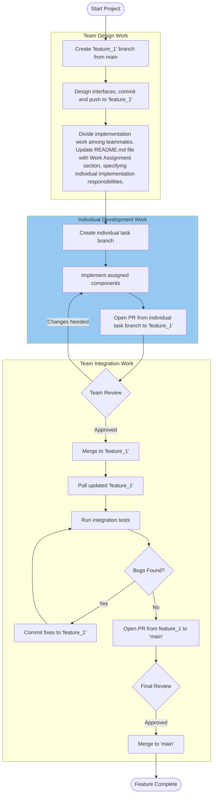

# CSE 4504 Team Project GitHub Workflow

During the development of this project, the following workflow will be used for each stage (feature). The diagram shows the workflow for feature_1. For each subsequent feature, the same workflow will be used (replacing feature_1 with a different feature number or name).

