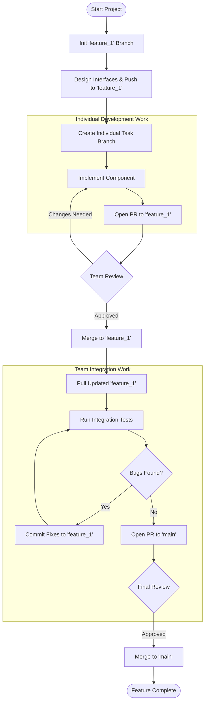
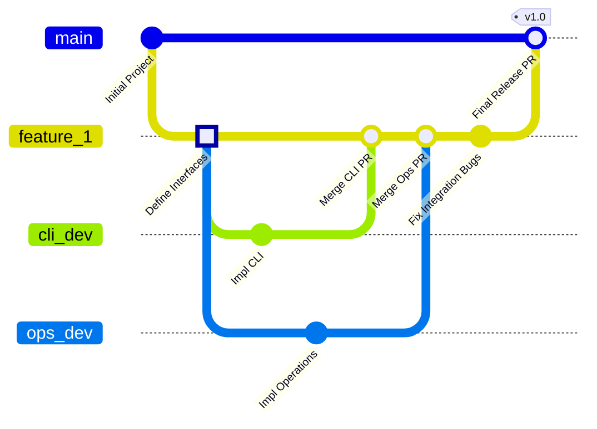

# workflow

```mermaid
flowchart TD
    Start([Start Project]) --> InitFeature[Init 'feature_1' Branch]
    InitFeature --> Design[Design Interfaces & Push to 'feature_1']
    Design --> BranchInd[Create Individual Task Branch]

    subgraph Individual Development Work
    BranchInd --> Implement[Implement Component]
    Implement --> PR_Ind[Open PR to 'feature_1']
    end
    Review_Ind -- Changes Needed --> Implement
    PR_Ind --> Review_Ind{Team Review}
    Review_Ind -- Approved --> Merge_Ind[Merge to 'feature_1']    
    Merge_Ind --> Pull[Pull Updated 'feature_1']

    subgraph Team Integration Work
    Pull --> Test[Run Integration Tests]
    Test --> Fix{Bugs Found?}
    Fix -- Yes --> FixCommit[Commit Fixes to 'feature_1']
    FixCommit --> Test
    Fix -- No --> FinalPR[Open PR to 'main']
    FinalPR --> Review_Final{Final Review}
    end

    Review_Final -- Approved --> MainMerge[Merge to 'main']
    MainMerge --> Done([Feature Complete])
```

```mermaid
gitGraph
    commit id: "Initial Project"
    branch feature_1
    checkout feature_1
    commit id: "Define Interfaces" type: HIGHLIGHT
    
    branch cli_dev
    checkout cli_dev
    commit id: "Impl CLI"
    
    checkout feature_1
    branch ops_dev
    checkout ops_dev
    commit id: "Impl Operations"
    
    checkout feature_1
    merge cli_dev id: "Merge CLI PR"
    merge ops_dev id: "Merge Ops PR"
    
    commit id: "Fix Integration Bugs"
    
    checkout main
    merge feature_1 id: "Final Release PR" tag: "v1.0"
```
